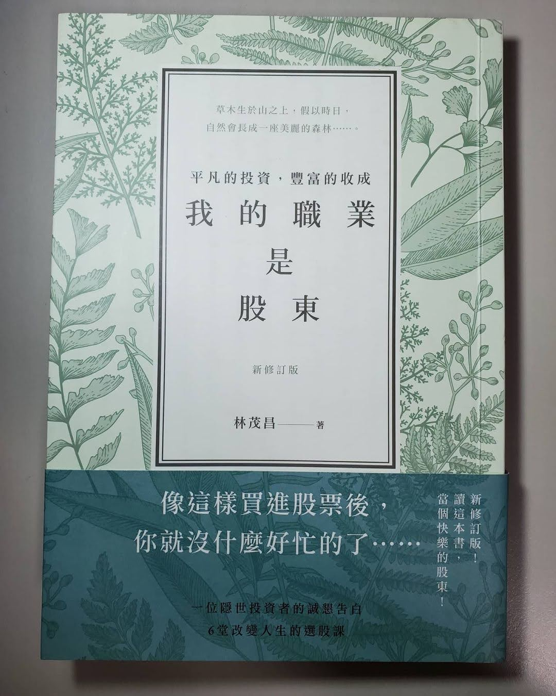

+++
title = "閱樂｜我的職業是股東"
description = "作者：林茂昌"
draft = false

[taxonomies]
tags = ["投資"]

[extra]
feature_image = "shareholder.webp"
feature = true
link = ""
+++

這是繼小時候看的一本叫做「速成鉅富」的書後，第一本關於投資理財的書籍，也是重拾閱讀習慣的第一步。

1. 成長股：普萊斯投資法則

2. 價值投資：賣股票是一種正和遊戲、護城河

3. 技術分析：順勢/逆勢操作、海龜投資法則

4. 跟股市高手們過招：隨機漫步理論、均數復歸、ETF、效率前緣、Sharpe ratio、「當大家都被動，就是你主動的時候」

5. 股災：列維飛行、幂次法則 (80/20 法則)、混沌理論、黑天鵝理論、股市是有漏洞可以賺錢的