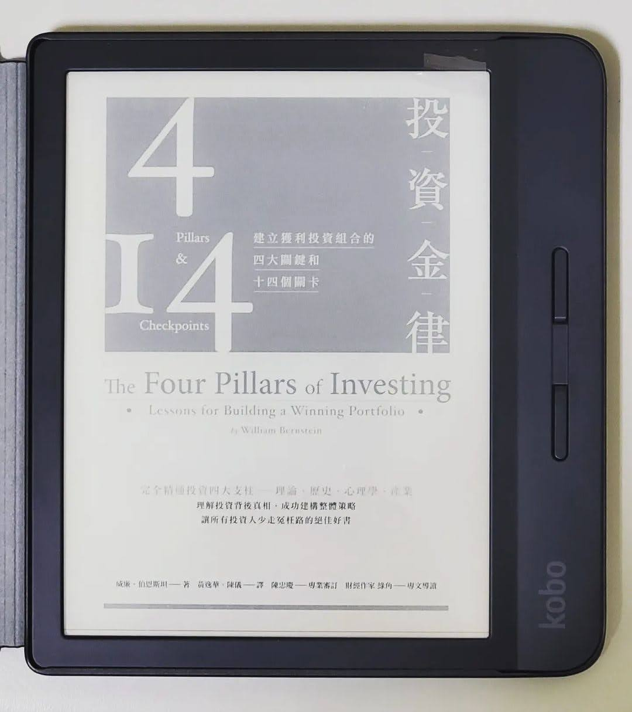

+++
title = "閱樂｜投資金律"
description = "作者：William Bernstein"
draft = false

[taxonomies]
tags = ["投資"]

[extra]
feature_image = "the4pillarsofinvesting.webp"
feature = true
link = ""
+++

蠻難的一本書，很多地方其實不是很懂@@

一、投資理論
- 風險與報酬相繫
- 高登公式
- 投資指數

二、投資簡史
小心市場經常會在榮窘兩端發狂似地胡亂奔走。當新科技看來將會改寫經濟及文化，而且發展有望時，那麼你將受益無窮，但此時，你千萬得看緊荷包，這種狀況歷史上司空見慣。另一個常見的狀況就是，當烏雲籠罩，幾乎連天空都要沈重得跌落下來時，這是通常就是買進的好時機。

三、投資心理學
- 最大的敵人其實就是自己
- 真正成功的投資必是個極為孤獨的行動，試著不要理會五年到十年內的投資報酬紀錄，應該著眼於更長的期限，愈久愈好。
- 資產類型報酬全然隨機

四、投資產業
不要相信股票經紀人和共同基金公司

五、整合思考
- 大型股市場
- 小型股市場
- 大型價值型股票
- 小型價值型股票
- 不動產投資信託、貴金屬