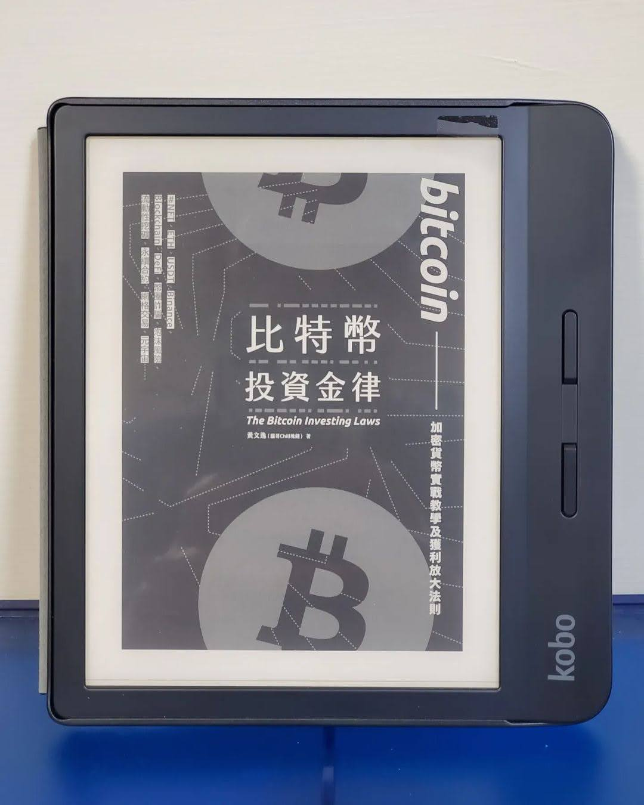

+++
title = "閱樂｜比特幣投資金律"
description = "作者：黃文逸 (腦哥)"
draft = false

[taxonomies]
tags = ["投資", "加密貨幣"]

[extra]
feature_image = "bitcoin.webp"
feature = true
link = ""
+++

介紹加密貨幣、比特幣的入門書。在這個變動快速的領域，很多新花樣將會一直出現，但這本去年年底才出版的書目前還是很值得一讀。

## 一、認識比特幣
1. 比特幣的誕生
2. 比特幣的特性：知識篇
- 沒有中央銀行的數位貨幣
- 多人協作的共同帳本「區塊鏈」
- 透過礦工「挖礦」維護系統運作
- 產量四年減半，限量 2100 萬顆
- 基於密碼學的虛擬貨幣，才能稱為加密貨幣
- 比特幣存放於錢包中
- 去中心化
- 礦工費 gas fee
3. 比特幣的特性：投資篇
- 比特幣有基本面嗎？系統性能、廣泛應用程度
- 劇烈波動的市場
- 四年一次的幣價循環
- 普遍偏高的放貸收益
- 交易全年無休
- 技術面、消息面、籌碼面 (Twitter)
- 萬幣之首
4. 比特幣簡史與價格走勢
5. 虛擬貨幣的價值來源：數位黃金、區塊鏈和加密貨幣產業興起 (以太坊)、華爾街漸漸認同
6. 比特幣未來展望與價格分析
- 看漲的理由：機構資金進場、供給持續減少、企業的應用、法規的完善、技術的穩定、年輕的愛好、區塊鏈的興起、國家的支持
- 看跌的理由：中國政策打擊、監管質疑、泡沫化、51 攻擊、其他不確定因素
7. 預測 BTC 價格的 S2F 模型

## 二、買賣加密貨幣實戰教學
1. 交易流程介紹
2. 主流交易所介紹
3. 幣託交易所教學
4. 幣安教學
5.重要加密貨幣種類介紹：BTC, ETH, USDT, BNB, ADA, DOT, LTC, DOGE, XRP, TRX, SOL, VET, UNI, AAVE, YFI, AXS
6. 必追推特名單與中文媒體
7. NFT：四大價值(收藏品與稀缺性、社交地位、冠名權、元宇宙)、泡沫化

## 三、詐騙類型和泡沫風險分析
1. 五種常見幣圈詐騙類型：在學習怎麼賺錢之前，先學習怎麼不賠錢
- 假投資平台/假交易所
- 假投資/傳銷幣
- 假社群/官方
- 資本盤 (龐氏騙局)
- 授權智能合約詐騙
2. 詐騙五大共同特色：快速獲利、名額和時間有限、講不清楚的獲利手段、拿比特幣出來吹噓、異常熱心的客服或推廣者
3. 量子電腦危機
4. USDT 成為灰犀牛？

## 四、進階幣圈投資：放大獲利的七種策略
1. 長期持有：HODL、價值投資、冷錢包
2. 合約交易 (future trading)：優點 (允許做多做空、支援高倍率槓桿、手續費較低、對沖風險)、嚴格設定停利停損、技術分析
3. 量化交易：網格交易、期現套利、DCA 機器人
4. 放貸收息：穩定幣 6-12%、主流幣 2-6%
5. 流動性挖礦
6. 擼羊毛：領空投、抽 IEO/IDO、推薦獎勵
7. 鏈上遊戲：Axie Infinity、Metaverse