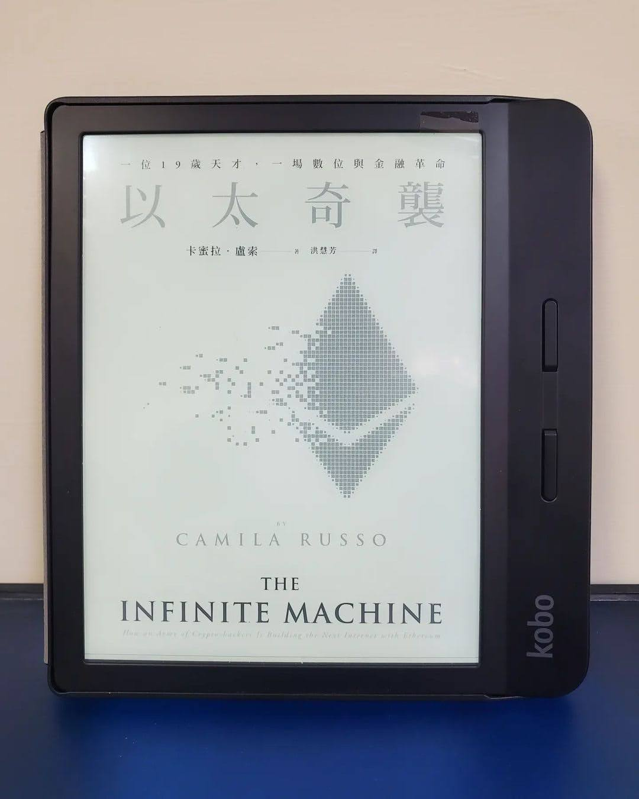

+++
title = "閱樂｜以太奇襲"
description = "作者：Camila Russo"
draft = false

[taxonomies]
tags = ["投資", "加密貨幣"]

[extra]
feature_image = "ethereum.webp"
feature = true
link = ""
+++

本書講述以太坊是如何從無到有，一步步建立起來的故事。從 Vitalik Buterin 的願景發想、2014 年混亂且充滿紛爭的創立過程，到 DAO 和上海攻擊事件、堅持去中心化，最後描述價格的起伏及 2017 年 ICO 熱潮中人性的投機貪婪，完整地架構出以太坊短短幾年的歷史，十分有趣。

最近剛入手少量比特幣和以太幣，對於這個新興領域 (也十多年了) 頗感興趣，一口氣看了兩本相關書籍。長期來看，配合 web3 的概念，可以期待區塊鏈技術和加密貨幣未來的蓬勃發展。
