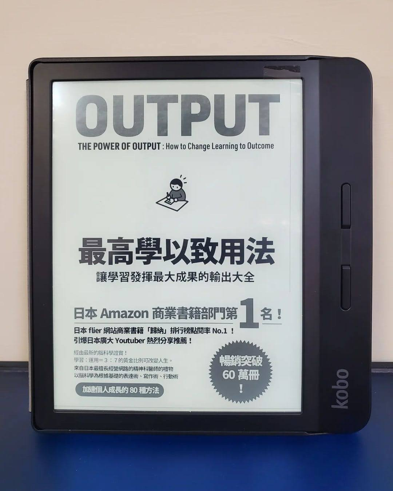

+++
title = "閱樂｜最高學以致用法：讓學習發揮最大成果的輸出大全"
description = "作者：樺澤紫苑"
draft = false

[taxonomies]
tags = ["學習"]

[extra]
feature_image = "output.webp"
feature = true
link = ""
+++

原本預期這本書只會討論「學習」上的輸出，但後來發現作者把輸出 (說和寫) 擴展到人與人之間的交流方法，諸如簡報製作、拒絕人的公式等等，在本書都有著墨。本書每個章節都短短的，閱讀起來很輕鬆，給的建議也都很具體，獲益良多。今後打算善用書中所述方法加強自己的輸出能力。

全書有很多小建議，這邊擷取三個概括性的重點：
📙 兩週內運用超過三次的情報，大腦會自動轉為長期記憶
📙 輸入和輸出的黃金比例 3:7
📙 檢視輸出結果 (反饋)，將經驗活用在下一次

----------
## 一、輸出的基本法則
1. 成長曲線取決於輸出量的多寡
2. 用身體去記憶的「運動性記憶」，是牢記的關鍵
3. 兩週內運用超過三次的情報，大腦會自動轉為長期記憶
4. 輸入和輸出的黃金比例 3:7
5. 檢視輸出結果 (反饋)，將經驗活用在下一次
6. 有效反饋的四個方法
- 克服弱點 or 發揮所長
- 加強寬度和深度
- 解決疑惑
- 請教他人

## 二、說 Talk
1. 事實 + 感想/意見
2. 多使用正面語言
3. 非語言溝通
4. 說話術：Yes But 、Yes And、Yes How
5. 打招呼
6. 單純曝光效應
7. 向自己提問
8. 向他人提問
9. 互惠原理
10. 拒絕：一定要毫不猶豫、事先決定優先順序、拒絕公式 (道歉/感謝 + 理由 + 拒絕 + 替代方法)
11. 簡報：化緊張為助力、10-30-100 法則
12. 針對「具體行為」讚美/斥責
13. 將「語意記憶」轉換成「情節記憶」
14. 自我介紹：用大家都聽得懂的方式、你的獨特之處、多利用數字、多提到對未來的展望、非語言溝通
15. 賣東西：展現價值

## 三、寫 Write
1. 動手寫而非打字
2. 輸入結束當下就輸出
3. 列出工作清單：寫/印在紙上、隨時放在桌上、完成就劃掉
4. 快速寫文章：設定好時間長度、決定架構
5. 記錄點子：你只有 30 秒
6. 放鬆才能獲得創意
7. 偶爾放空可以活化大腦
8. 利用便條紙激發靈感、決定結構、再製作投影片 (先傳統再數位)
9. 引用的魔法
10. 用 140 字鍛鍊摘要能力
11. 設定目標：稍微困難的程度、設定期限、加上具體的行動、找到客觀評價的方法、分成小目標、公開宣告

## 四、做 Do
1. 教人
2. 不要multi-tasking
3. 先開始做了再說，啟動伏隔核
4. 選擇令自己感到興奮的、選擇一開始想到的
5. 以 30 分為目標先完成再慢慢修改
6. 控制憤怒
7. 利用空檔時間專注輸出、利用手機輸出

## 五、提升輸出力的七大訓練
1. 寫日記：寫正面的事、將負面的事轉成正面來寫
2. 記錄健康狀態：體重、狀態、睡眠時間
3. 寫讀後感想：Before + 發現 + To do
4. 發送情報
5. 在社群媒體上發文
6. 寫部落格：獨立網域、每天更新、100-300-1000 法則
7. 寫自己有興趣的題目