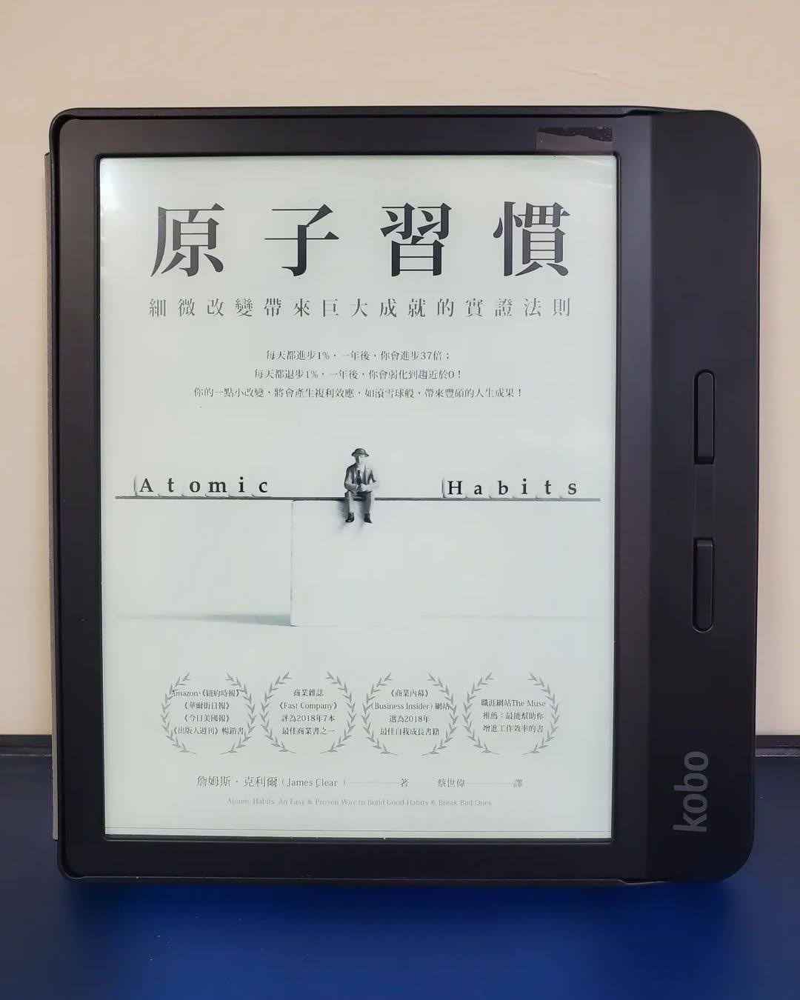

+++
title = "閱樂｜原子習慣"
description = "作者：James Clear"
draft = false

[taxonomies]
tags = ["習慣養成", "成長"]

[extra]
feature_image = "atomichabits.webp"
feature = true
link = ""
+++

真不愧是蟬聯好幾年的暢銷書，名不虛傳！作者於本書中運用大量例子說明習慣養成的四大法則 (提示、渴望、回應、獎賞)，且給予許多實質的建議和公式，讓讀者有個明確的方法可以遵循。除了養成好習慣外，也進一步反轉四大法則，將之運用在壞習慣的戒除。值得推薦的五星好書！

習慣養成的四大法則：
📘 讓提示顯而易見
📙 讓習慣有吸引力
📘 讓行動輕而易舉
📙 讓獎賞令人滿足

----------
## 一、基本原理
1. 習慣的複利效應
2. 想要造成有意義的差異，你必須維持一個習慣夠久，以突破停滯期
3. 別管目標，而是專注於系統
4. 改變分為三個層次：成果改變、過程改變、身分認同改變
5. 改變習慣最有效的方法，是改變身分認同 (希望成為什麼樣的人)，並透過生活中的小勝利來證明，這是個回饋迴路。
6. 習慣可以讓你騰出自由思考與創意所需的心理空間
7. 習慣形成的四步驟：提示、渴望、回應、獎賞。
8. 讓提示顯而易見，讓習慣有吸引力，讓行動輕而易舉，讓獎賞令人滿足。(若想要破除壞習慣，則可以反轉這些法則)

## 二、法則一：讓提示顯而易見
1. 行為改變的過程始於有意識地察覺自身習慣：指差確認、習慣計分卡
2. 執行意象：我會於 [時間]，在 [地點] 進行 [行為]
3. 習慣堆疊：做完 [目前的習慣] 之後，我會執行 [新的習慣]
4. 想要讓習慣成為生活的一大部分，就讓提示成為環境的一大部分
5. 在新環境中比較容易改變習慣
6. 一個空間，一個用途
7. 打造一個有紀律的環境
8. 要剷除一項壞習慣，最實用的方法之一就是減少接觸會激發此惡習的提示

## 三、法則二：讓習慣有吸引力
1. 讓我們採取行動的，是對獎賞的預期，而非獎賞的實現
2. 誘惑捆綁：做完 [目前的習慣] 之後，我會執行 [我需要的習慣] + 做完 [我需要的習慣] 之後，我會執行 [我想要的習慣]
3. 社會常規的誘人拉力：模仿親近的人、模仿多數人、模仿有力的人
4. 加入一個把你想要的行為視作常態的文化
5. 若一個行為能獲得認可與讚美，我們就會覺得那個行為有吸引力
6. 習慣是古老慾望的現代解決方案
7. 與正面 (負面) 感受產生連結，習慣就有 (沒有) 吸引力。
8. 創造一個動機儀式：在執行困難的習慣之前，做一件你很享受的事。

## 四、法則三：讓行動輕而易舉
1. 精通習慣由重複開始，而非完美 (實行而非計畫)
2. 習慣的養成取決於頻率，而非時間
3. 最小努力原則：創造一個讓正確的事情盡可能容易執行的環境
4. 兩分鐘法則：先從容易的事養成習慣、開頭儀式
5. 承諾機制：用當下做的選擇來鎖定未來比較好的行為。
6. 鎖定未來行為的終極之道，是將習慣自動化，可以善用科技
7. 一次性選擇，例如購買更好的床墊，能讓未來的習慣自動化，而且其回報會隨著時間增加的單一行為
8. 增加壞習慣的步驟，讓行動困難無比

## 五、法則四：讓獎賞令人滿足
1. 立即的獎賞增加我們下一次重複該行為的可能性
2. 習慣追蹤器與視覺化的測量方式：我們不喜歡中斷連續紀錄、就算中斷了也不要錯過兩次
3. 可以測量一樣事物，不代表那就是最重要的東西
4. 讓壞習慣的後果令人不滿
5. 習慣契約與問責夥伴

## 六、進階策略
1. 配合性格打造習慣，選擇最適合你的習慣，而不是最受歡迎的習慣
2. 當你無法靠著「更好」來贏，可以憑藉「不同」勝出
3. 金髮女孩原則：執行難度恰到好處的任務，可以維持動力
4. 變動獎賞、愛上無聊：成功最大的威脅不是失敗，而是無聊
5. 習慣的壞處在於讓我們不再注意到微小的失誤
6. 習慣 + 刻意練習 = 精通
7. 反省與複查是一個讓你對自身表現長久保持差覺察的過程
8. 愈是緊抓一個身分認同不放，愈難讓自己超越這個身分成長