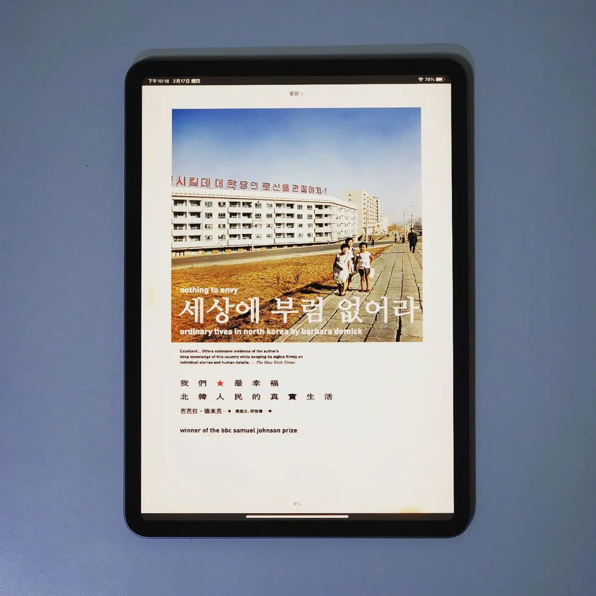

+++
title = "閱樂｜我們最幸福：北韓人民的真實生活"
description = "作者：Barbara Demick"
draft = false

[taxonomies]
tags = ["北韓", "報導文學"]

[extra]
feature_image = "northkoreacitizen.webp"
feature = true
link = ""
+++

作者為洛杉磯時報駐首爾記者，本書是她採訪六個脫北者和一些清津 (北韓北方城市) 居民編織而成的故事。這不是一本全面的北韓史，而是北韓人民日常生活的經驗紀錄，藉由順敘的手法讓讀者了解這些脫北者是怎麼隨著時代變遷一步步改變心境，最終脫離極權體制的控制。

令我比較驚訝的是，在 1960 年代，因為工業實力還不錯，北韓人民的物質生活要比南韓好，甚至還有一些相信金日成共產理想的人們從日本歸順北韓。當然最終理想幻滅，1990 年代因為糧荒、蘇聯解體導致的廉價燃油供應中斷、加上金正日將國家經費用於發展核子武器，使北韓陷入饑荒地獄以及沒有電的黑暗世界，造成數百萬人死亡。身在這種環境，人們為了活命開始發展小生意，甚至聚集成市場，偏偏這是政府所不允許的。在昧著道德活下去的飢餓環境，讓這些人產生脫離北韓的想法，甚至有些人還是忠貞的金氏政權信仰者。書的最後也提到脫北者成為南韓公民後所要面對的生存困境，包括多元選擇的自由社會、自卑心作祟導致的格格不入、以及把家人留在北韓的罪惡感。

YouTube 上有不少到平壤旅遊的影片，但這些畫面都是北韓政府精心設計的。這本書的內容縱使未必都是正確的，但至少提供給我們看待北韓的不同觀點。