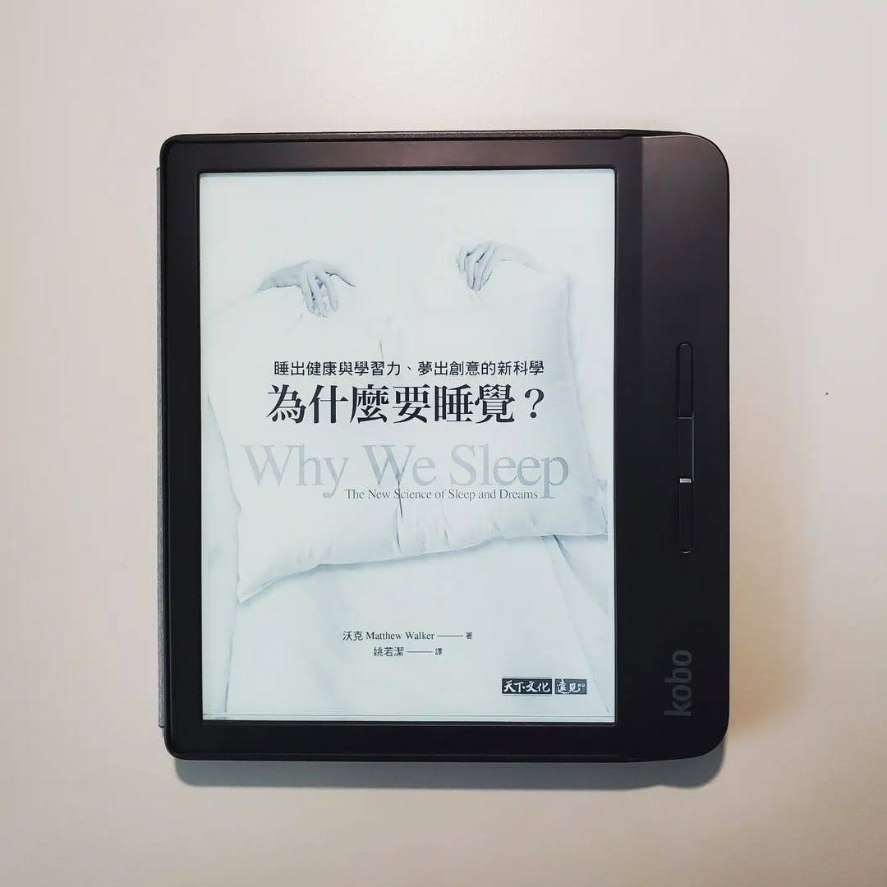

+++
title = "閱樂｜為什麼要睡覺？"
description = "作者：Matthew Walker"
draft = false

[taxonomies]
tags = ["科學"]

[extra]
feature_image = "whywesleep.webp"
feature = true
link = ""
+++

本書介紹了睡眠究竟是什麼、睡覺有什麼好處、不睡覺又會有什麼壞處。接著談到做夢和安眠藥，最後提出現今社會對睡眠的不重視所造成的危害，以及我們應該怎麼去改變。看這本的書的過程中，偶然在網路上看到日本有個叫堀大輔的人，每天只睡 30 分鐘，並且持續 12 年。他甚至出了一本書教導別人怎麼進行超短睡眠，並宣稱不睡覺不會影響健康。然而實際看了日本節目採訪他的影片，他的黑眼圈超級重，臉色也不是很好。身為醫療業，我想我還是比較相信這本由睡眠科學家所寫且充滿實證的書...

總之，也是本實用的書。希望更多人能認知到睡眠是件重要的事，社會制度也能有所調整 ，近期的高中延後到校、住院醫師 day off、彈性上下班時間等，至少都是往好的方向邁進。

---

本書分為四個部分：
## 一、睡眠是什麼？
1. 近日節律和腺苷累積的睡眠壓力是造成我們想睡覺的兩個原因
2. 晨型人 40%，夜貓子 30%，剩下的 30% 介於中間。通常為遺傳決定
3. 褪黑激素的分泌遵循近日節律，它宣布睡眠開始，但本身不造成睡眠。往東飛比往西飛的時差更難調，每一天你的視交叉上核只能約調整一小時的時差。
4. 咖啡因能遮蓋腺苷的睡眠訊號，喝下咖啡後 30 分鐘左右，體內循環的咖啡因濃度達到高峰，半衰期平均為 5-7 小時。咖啡因崩潰為當肝臟漸漸清除咖啡因後強烈的睡意反彈
5. REM -> NREM 四期，每次循環 90 分鐘。NREM 負責清除不需要的神經連結，REM 則是加強連結，愈到後半夜 REM 比例愈大。清醒狀態「接收」，NREM「反思」，REM「整合」
6. 人類適合午睡
7. 補眠無法補回所有損失
8. 生命初期 REM 較長，到了兒童晚期和青少年前期，漸漸轉為 NREM 為主，最終成人 NREM:REM=8:2。青少年的近日節律時程比成年父母後移，晚睡晚起，不是因為懶惰
9. 成年人隨著年紀漸長，睡眠有三項主要的改變：一、深度 NREM 量與質的降低；二、睡眠片段化，睡眠效率的降低；三、近日節律提早使睡眠的時機受干擾。但老人家需要的睡眠沒有比較少

## 二、睡眠與缺乏睡眠的利弊得失
1. 深度 NREM 紡錘波可以恢復學習能力，其在睡眠後期的早晨階段 (最後兩個小時) 特別豐富
2. 睡眠可以修復記憶、遺忘特定記憶、提升動作技能，同樣跟 NREM 有關
3. REM 會把完全不同的知識連接起來，產生創意力
4. 每晚睡六小時，連續十天之後，表現失常的程度和連續二十四小時沒睡的人一樣。連續一週睡眠不足時，經過三晚的補眠 (超過週末的兩晚)，是無法把表現修復到正常水準的。且人腦在睡眠不足的情況下，沒辦法準確感覺自己睡眠不足的程度。
5. 疲勞駕駛和酒後開車一樣危險
6. 若無法避免睡眠剝奪，提早小睡，預防勝於治療，但仍無法取代一夜好眠
7. 有少睡基因，但很稀有
8. 睡眠不足時，腦內情緒中心的反應會更強烈，也與精神疾病有關
9. 睡眠不足對身體的各種危害：癌症、心臟病、交感過度活躍、糖尿病與肥胖、生殖、免疫力、精神疾病、阿茲海默症，以及壽命變短

## 三、為什麼會做夢？
1. REM 狀態時，視覺、運動、情緒和自傳式記憶相關的腦區十分活躍，而控制理性思考的區域相對不活躍
2. 夢境不是我們日間生活的重播，但卻可能與白天的情緒共通
3. 夢見醒時創傷的情緒主題和情感能舒緩傷痛，與睡眠正腎上腺素濃度低有關
4. REM 中做夢使我們能夠準確辨識臉部表情和情緒，若剝奪這部分睡眠，外在世界變成充滿威脅和令人厭惡的地方
5. 做夢與創造力有關，它連結了原本並不明顯的遙遠關聯。夢的內容也很重要
6. 清明夢是存在的，但目前仍不清楚其究竟是好是壞

## 四、從安眠藥到翻轉社會
1. 夢遊發生在深度 NREM，兒童更常見，多數是無害的
2. 失眠分成兩型：入眠困難型失眠、睡眠維持困難型失眠。失眠者交感興奮、核心體溫升高、皮質醇濃度提升、情緒和回憶中心活躍、腦幹警覺中心活躍
3. 猝睡症的三個特徵：白天異常想睡、睡眠麻痺 (鬼壓床)、情緒激動後猝倒。猝睡症與下視丘的食慾激素異常有關
4. 致死性家族失眠症是 PrNP 基因突變，造成腦中異常的 prion 攻擊視丘，使其晚上無法關閉接收訊息
5. 死亡隨著完全剝奪睡眠而來的速度，和完全剝奪食物的速度一樣
6. 睡眠 8 小時 + 16 小時清醒時間
7. 五項因子影響睡眠長度和品質：持續的燈光和 LED 光、固定的室溫 (18.3°C)、咖啡因、飲酒 (抑制 REM)、上班打卡的傳統
8. 安眠藥產生的睡眠和自然睡眠不同，記憶鞏固效果不強。停用安眠藥導致反彈性失眠。安眠藥使用者死亡風險提高
9. 失眠認知行為治療 (CBT-I) 為目前建議的第一線治療方法
10. 睡眠狀況提升，運動能力也會跟著提升。而維持運動習慣，會增加睡眠總量，特別是 NREM，也能提升睡眠品質
11. 避免上床時過飽或過餓，並且避免過度偏向高碳水化合物的飲食