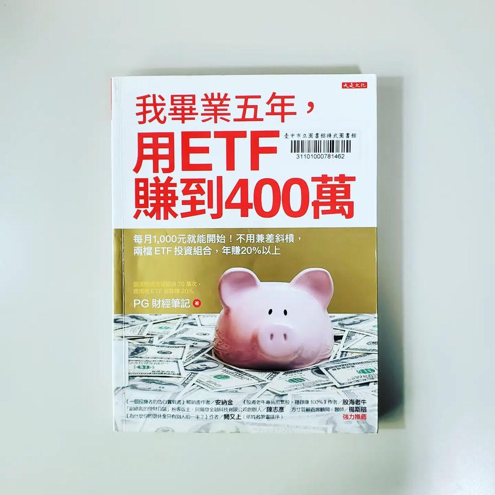

+++
title = "閱樂｜我畢業五年，用 ETF 賺到 400 萬"
description = "作者：PG 財經筆記"
draft = false

[taxonomies]
tags = ["投資"]

[extra]
feature_image = "ETF400.webp"
feature = true
link = ""
+++

指數化投資的入門書籍。書中的概念基本上都很熟悉了，就是利用 ETF (Exchange Traded Funds，指數股票型基金) 分散投資降低非系統性風險，並長期持有以獲取市場報酬。以下幾個是比較重要或新學到的知識：

## 一、資產配置
1. 影響報酬率的最大關鍵
2. 依照自身風險承受度決定股債比

## 二、分散全球 (股票部位)
1. VT
2. VTI + VXUS
3. VTI + VEA (成熟市場) + VWO (新興市場)
4. VTI + VGK (歐洲) + VPL (太平洋) + VWO
5. 書中沒寫到，不過我個人是買 VWRA

## 三、債券
1. 投資債券首重安全，而非報酬
2. 長期來看，債券的報酬率只源自於它的孳息，且與大環境利率水準息息相關
3. 保守：短中長期美國政府公債 (VGSH, SHY, VGIT, IEI, IEF, VGLT, TLT)
4. 怕風險又想賺高利息：美國綜合債券 ETF (BND, AGG)、全球綜合債券 BNDW (48% BND + 52% BNDX)
5. 四個債券風險：
- 利率風險：利率上升，債券價格下跌。長期債券 > 短期債券
- 收入風險：利率下降時，債券配息便會降低，收入跟著降低。短期債券 > 長期債券
- 信用風險：債券 ETF 因分散持有，較沒有這問題
- 匯率風險

## 四、衛星配置
1. REITs：VNQ (美國)、VNQI (非美)、REET (全球)
2. 貴金屬

## 五、選擇 ETF 的注意事項
1. 總開銷：迴避高成本 ETF
2. 指數追蹤績效：避免拿不到該有的報酬。追蹤偏離度最多 0.3%。追蹤誤差為偏離度的標準差
3. 資產規模：降低清算風險
4. 成交量與流動性：買賣價差愈小愈好。建議至少每日成交量大於 10 萬股
5. 成立時間：影響可檢視的歷史資料。至少滿三年
6. 市場領先地位：享受加成優勢。如 Vanguard、iShares