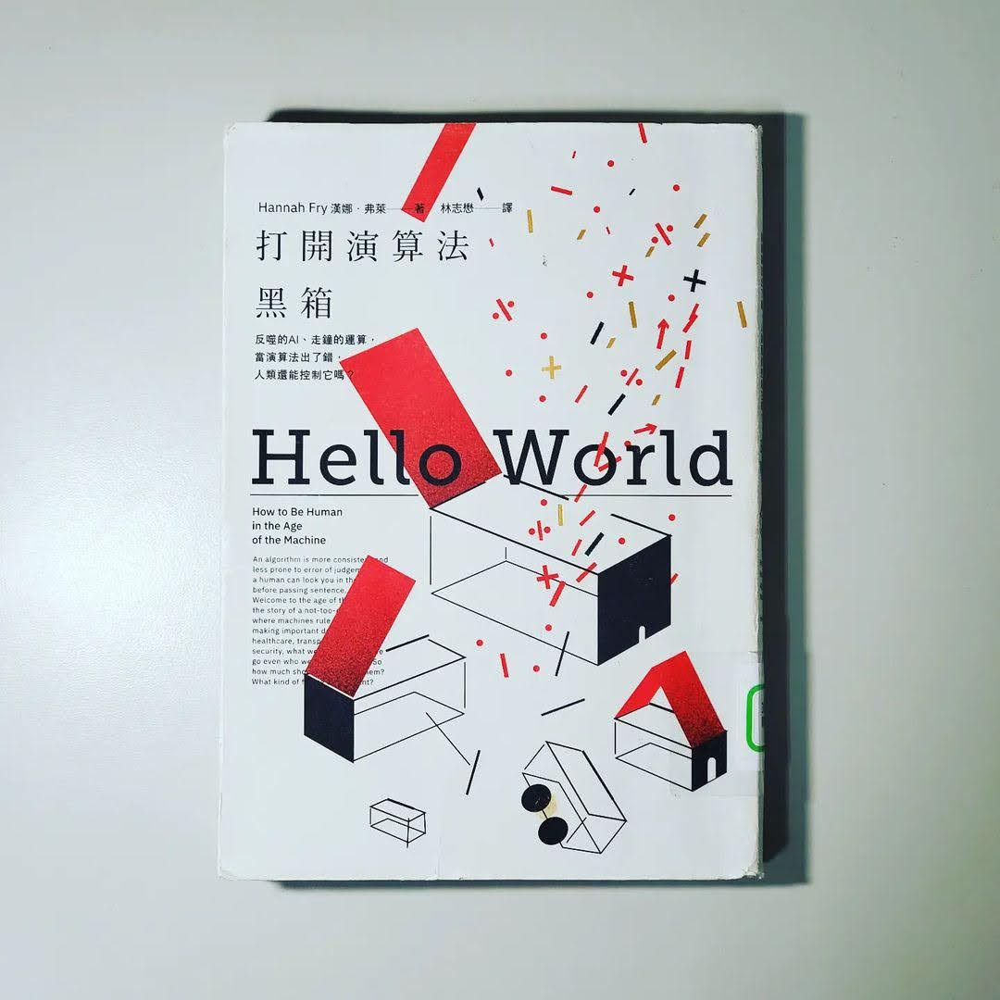

+++
title = "閱樂｜打開演算法黑箱"
description = "作者：Hannah Fry"
draft = false

[taxonomies]
tags = ["科學"]

[extra]
feature_image = "helloworld.webp"
feature = true
link = ""
+++

「演算法，一種按步驟解決問題或達成某種目的之程序，尤其是藉由電腦。」

本書分別從六個領域探討演算法在讓我們生活變得更加便利與進步的同時，人們是怎麼過於依賴和相信它們，並把自己的權力交出去。舉例來說，有人因為相信 google map 的導航路線差點掉下懸崖。又如搜尋引擎建議的搜尋結果決定我們看到什麼內容，進而影響選舉的結果，但人們不曉得自己正被操弄。

演算法會犯錯、會不公正，但人類也不是完美的。我們應該將演算法定位成人類出錯時會進行矯正救濟的角色，和人類以夥伴關係一起合作，善用彼此的強項，包容彼此的缺點，而非全然交給演算法做主。我想這是這本書想帶給我們的啟示。

----------
## 一、資料
這些隱藏在背景畫面中的演算法，正運用你不知道它們擁有且絕不主動提供的資料謀利。它們已經把你最個人、最隱私的秘密，變成一種商品。每次當你把資料雙手奉上，資訊就被蒐集賣給資料仲介。這些資料被整合起來，然後創造出僅此一份、鉅細靡遺的檔案，一份針對你的數位分身所做的個人簡介資料檔。這些資料可以作為精準投放廣告、推斷個人身分、甚至公民評分系統等用途。

## 二、司法
只要法官有自己評估案件的自由，便會有大量的不一致狀況。容許法官有自由裁量的空間，意味著容許這個系統含有運氣的成份。利用隨機森林的演算法，以隨機分段的資料，建立數千個較小的決策樹，接著要求每一個決策樹投票，取所有答覆的平均值。市面上有很多種類似的系統可以預測罪犯再犯風險，並評估可否交保。然而要小心偽陰性與偽陽性，在公平與誤判的天秤上取得平衡。

## 三、醫療
1. 醫生有跟多面向大概是演算法永遠無法複製的，同理心是其中一項。
2. 人類在特異度上表現好，而演算法則是在靈敏度上更勝一籌。兩者的合作模式，可以提升準確度又可節省時間。不過跟司法領域一樣，要擔心過度診斷造成的過度治療。
3. 華生不會一直是個幻想，但要讓他成真， 我們需要放棄隱私權，我們的紀錄可能受到危害、遭竊取或被用來對付我們。例如世界上很多國家可以拒絕糖尿病患投保或治療。
4. 提供唾液樣本給基因體及生物科技公司，換得你的遺傳性狀報告，與此同時，該公司也累積了巨大的基因資訊資料庫。如果你授權同意 (有 80% 的客戶這麼做)，該公司會將你的基因資料以匿名的形式賣給其他研究夥伴，如學者和製藥公司賺取可觀的利潤。每當你寄出樣本換取商用基因報告，有件事應當牢記在心：你不是在使用產品，你就是產品。

## 四、車輛
太過依賴自動系統的潛藏危機，像是導致人類能力的退化，例如法航 447 號空難。沒有在注意狀況的駕駛人，就在你需要對路況最了解的那一刻，你將會是最不清楚的那個；加上缺乏練習，在你得處理需要最高階技巧的狀況時，你的準備將會是極盡可能的差。讓機器的技能與人類的技能互補，像是 Volvo 的自動緊急煞車 (守護神模式，而非司機模式)

## 五、犯罪
演算法只能預測未來發生某些事件的風險，而非預測事情本身。演算法能讓人們更容易事先阻止潛在的犯罪，但演算法誤差也可能會錯誤地犧牲無辜者。人們為了前者會願意犧牲後者到什麼程度？

## 六、藝術
托爾斯泰說，藝術不是手工藝品，而是傳達藝術家所體驗到的感受。那麼演算法所製作的作品可以稱作藝術嗎？