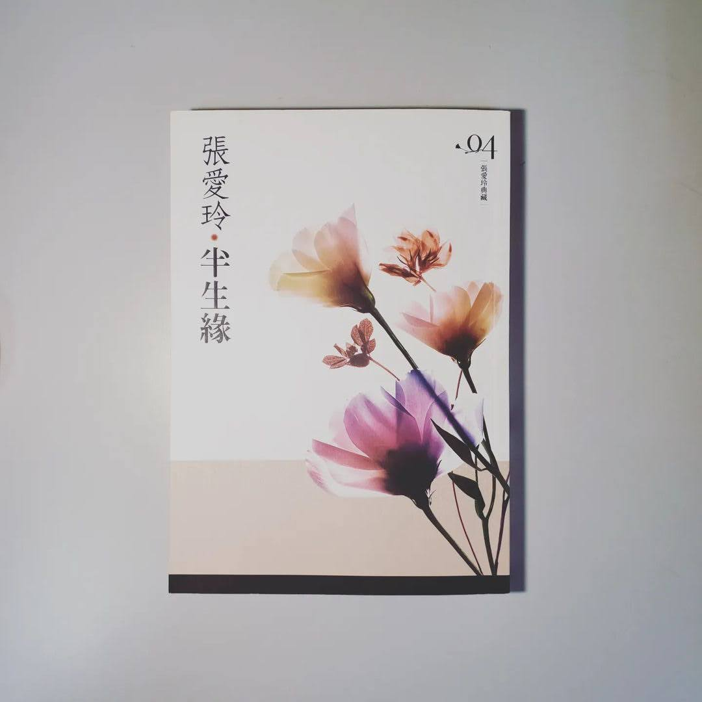

+++
title = "閱樂｜半生緣"
description = "作者：張愛玲"
draft = false

[taxonomies]
tags = ["文學小說"]

[extra]
feature_image = "banshengyuan.webp"
feature = true
link = ""
+++

有一個場景，在多年之後，還是讓曼楨深深地眷戀著：

他與世鈞並肩走在馬路上，看著黃色的大月亮從蒼茫的人海中升起，像一盞街燈低低地懸在街頭，無言地召喚著如夢的青春。然而所有的美好卻像在醞釀一個不祥的的預兆！曼楨怎麼也沒想到，她與世鈞最快樂的光陰竟是如此短暫，在那之後，她將度過一段怎麼也無法回首的歲月！

當時光流轉，曼楨在偶然的機緣與戀人重逢時，一句「世鈞，我們回不去了。」所有關於愛情的千迴百轉、關於生命的千瘡百孔，瞬間都化為惘然。而世鈞也才終於發覺，原來愛不是熱情、不是懷念，愛不過是歲月，年深月久就成了生活的一部分......

---
說實在的，我很討厭書中這種強暴的情節 (之前房思琪也是因此沒看完)，不過還是耐著性子讀完了。這讓我想到之前在精神科見習的時候，聽著主治醫師和一名思覺失調的阿嬤會談，講到她之所以會嫁給她先生也是因為他對她做了無禮的事，每每想起我總會感嘆這段時代悲歌。不過除卻這個情節，本書其他部分我還算喜歡，或許過時的傳統禮教令人不快，但也的確刻劃出人生聚散無常的本質。