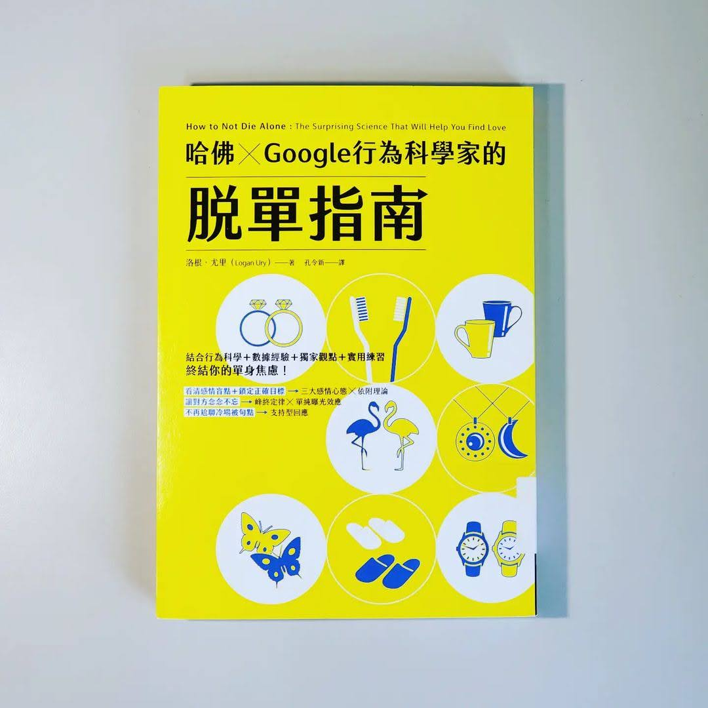

+++
title = "閱樂｜哈佛 x Google 行為科學家的脫單指南"
description = "作者：Logan Ury"
draft = false

[taxonomies]
tags = ["科學", "感情"]

[extra]
feature_image = "hownottodiealone.webp"
feature = true
link = ""
+++

前陣子感情上遇到一點挫折，搜尋很多本書的書評後借了這本。只能說，完全沒讓我失望！

「愛或許是人的本能，但交往並不是。善用行為科學，能讓你順利找到伴侶。」

本書以行為科學為基石，前幾章提出幾個理論 (如依附理論)，將人們歸類成數種類型，每種類型的人在尋找伴侶以及和戀人相處時都有一些常見的盲點，書中也教我們該如何因應。

如今交友軟體漸漸成為人們認識對象的管道之一，作者身為美國某交友軟體的顧問，也在中間的章節分享許多網聊的實戰技巧，以及該怎麼打造暖心的超棒約會。

最後，當感情關係出現問題，要如何溝通調整、和平分手、甚至處理後續的情緒；又如感情昇華進入婚姻，兩人該做什麼事前準備、怎麼長期經營，在最後的幾個章節中都有著墨。

本書寶藏滿滿，不只適合想要脫單的人閱讀，對於想要好好長久經營一段感情的情侶們來說也是一本不可多得的好書！

---
## 筆記內容

- 愛或許是人的本能，但交往並不是。善用行為科學，順利找到伴侶
- 在這個時代談戀愛，比過去更困難，因為我們更自由了
- 浪漫派對感情、完美派對伴侶、猶豫派對自己保持不切實際的期待
- 浪漫派 (拒絕不符合自己對愛情憧憬的對象)
    - 沒有完美的人
    - 任何感情關係都需要努力經營，沒有所謂從此過著幸福快樂的日子
    - 比起癡癡等邂逅，努力創造機會才重要
- 完美派 (希望盡可能做出最好的選擇，會經常思考是否還有其他潛在對象，FOMO)
    - vs. 滿足派：都做出優秀選擇，完美派覺得自己選的不好，但滿足派覺得自己選得很好。
    - 找到還不錯的對象就安頓
    - 如果你全心投入愛對方，你的大腦就會說服你這是個好的決定
    - 秘書問題正解：先面試 37% 的應徵者，然後暫停並找出第一批當中最優秀的人，以他為重要基準，接著繼續面試剩下的人，遇到第一個優於基準的人就僱用他。尋找戀愛對象則是用時間作為分界，假設尋找對象的期間是 18-40 歲，根據 37% 法則，他應該在 26.1 歲起，從尋找轉變為跳躍。
    - 把完美派那充滿焦慮的問號，轉變成滿足派那充滿信心的句號
- 猶豫派 (想完全做好準備才開始談戀愛，卻沒想到這樣會錯失學習的機會，談戀愛也是需要學習的)
    - 設定最後期限、做功課準備、告訴別人我要去約會、認同自己是約會派的新身份、設定具體可達成的目標、學習用體諒的語氣對自己說話
    - 我們希望有可反悔的選項，但長期而言，選擇後不可改變會使我們更快樂。所以別再和前任聯絡。
- 依附理論
    - 焦慮型依附 20%
    - 安全型依附 50%，最多，但佔單身的人口比例較少
    - 逃避型依附 25%
    - 焦慮-逃避型依附 5%
    - 尋找安全型依附的伴侶和學習管理自己的情緒
- 尋找人生伴侶，而非短期伴侶
    - 沒那麼重要的特質
        - 金錢：重要但也不重要，年薪超過 75000 美元後，情緒幸福感就不再隨年薪增加而增加
        - 外貌：性慾總有一天會衰退
        - 個性：尋找個性互補的對象
        - 興趣：興趣不同沒關係，只要在追求興趣的同時，互相給予空間和自由。伴侶無法扮演所有角色
    - 重要的特質
        - 情緒穩定、心地善良：最重要的特質
        - 忠誠心：有無長期友誼是判斷有沒有忠誠心的指標
        - 成長型思維
        - 能引發出你最好的一面
        - 處理爭執的能力：69% 的感情衝突屬於常態性衝突，永遠會存在。目標不是說服對方改變，甚至也不是達成共識，而是找到有用的方法與不同想法共存。挑選長期伴侶，也是在挑選一組無法解決的問題。處理爭執的第二步在於和好，避免吵更凶的言語或行為。重點在於怎樣處理爭執，而非完全避免爭執
        - 共同做出困難選擇的能力
- 交友軟體
    - 問題
        - 表列顯示的特質很膚淺，像是身高薪水，讓我們以為這些非常重要
        - 一開始侷限的偏好設定會讓我們篩選掉優質潛在對象
        - 以選擇商品的方法選擇伴侶
        - 選項太多使人優柔寡斷
        - 自動腦補美好的想像
    - 方法
        - 變更篩選條件
        - 看別人自我介紹時不要妄下定論
        - 避免同時和太多人約會
        - 挑選優質照片：清除展現外貌和感情狀態、女性「獨自站立、看向一旁、露齒微笑」、男性「獨自站立、直視鏡頭、不露齒微笑」、抓拍比擺拍好、自拍效果差 (尤其是在廁所自拍)、黑白照片的效果超好
        - 仔細撰寫自我介紹：忠實呈現自我性格、具體描述喜好以以順利引發對話、不散發負面能量
        - 練習不被句點的開場白：可以從照片和簡介提問和開話題
        - 適時保持聯繫，並盡快展開追求：「我真的很喜歡我們聊天的感覺，請問你願意星期天下午一起出來散步繼續聊嗎？三點 OK 嗎？」
- 現實生活怎麼認識人
    - 參加對你可行且與人互動機率高的活動
    - 請求親朋好友安排相親
    - 嘗試去找認識的人試探
    - 出門在外時，向他人介紹自己
- 如何打造暖心的超棒約會
    - 第一次約會的目的，不是決定要不要和對方結婚，而是試探你對對方是否好奇，對方有沒有讓你覺得他擁有之後相處會愉快的特質
    - 體驗式約會而非評審式約會
        - 藉由約會前儀式轉變心態
        - 仔細挑選約會的時間和地點：並排而坐或散步，兩人沒有眼神接觸時比較容易講事情
        - 選擇創意活動：有話題聊的活動
        - 展現出你所做的努力
        - 放開心地去玩
        - 跳過寒暄，使用「攔腰法」聊天：直接進入朋友或愛人之間可能會出現的對話
        - 不是急著展現自己，而是要讓對方感覺良好：學習給出支持型回應 (鼓勵對方把故事繼續說下去)，而非轉移型回應 (把對話的焦點轉回到自己身上)
        - 少滑手機
        - 精彩收尾
        - 運用「約會後八問」有效體驗約會
            - 對方引發出我的什麼性格
            - 在約會當下我的身體有什麼感覺？僵硬、放鬆還是介於兩者之間
            - 約會後，我覺得更有活力還是更沒活力
            - 對方有沒有讓我感到好奇的地方
            - 對方能讓我大笑嗎
            - 覺得自己的心聲或想法有被聽見嗎
            - 與對方相處時，我覺得自己有魅力嗎
            - 我覺得著迷、還是感到無聊，或是介於兩者之間
- 第一眼的愛情火花
    - 感情關係初期，通常沒有怦然心動，投緣感覺可以慢慢培養
    - 有愛情火花未必是好事
    - 即使火花能引發長期關係，但還不足以維持關係的運作
    - 與其要火花，還不如漫燃
- 促成下一次約會
    - 練習著眼在對方的正面特質
    - 基本歸因謬誤：有人犯錯時，我們會認為這個錯誤表現出某種人格本質，我們不會幫他找外部原因來解釋這個行為
    - 預設自己除非發生很誇張的事情，一定會給對方第二次約會的機會
    - 明確定義出你可以接受的小毛病
    - 不要消失式分手
- 決策點
    - 「決定」是對雙方關係的轉型，可以做下決定。「滑行」指的是沒仔細思考就滑入下一階段
    - 「定義關係」是重要的決策點
    - 開啟困難對話的一個技巧，就是坦言自己覺得尷尬；說自己不知道要怎樣在別人面前稱呼對方
    - 請用同情心和好奇心接納對方的說法，即時回應讓你感到失望，也一定要感謝對方分享想法
    - 同居也是重要的決策點，會提升情侶結婚的機率
    - 相較於婚前沒有同居的情侶，婚前同居的情侶，婚後的滿意度較低且離婚率較高
    - 同居會大幅提升分手的成本，令人很難誠實看待兩人關係的品質
    - 「決定」同居，而非「滑入」同居，深入討論兩人對目前關係所處的階段，以及對未來方向有所共識，也建議討論心中對於同居有什麼恐懼或疑慮
    - 同居前，回答下列問題：
        - 兩人為何要同居？
        - 同居對你的意義為何？
        - 你對這段關係有什麼期待？
        - 兩人有沒有考慮結婚？如果有，預計何時結婚？
        - 你對同居有什麼恐懼？
- 分手
    - 太早分手與太晚分手都是損失
    - 低潮不是崩潰點，也不是分手點
        - 紀錄想分手的原因
        - 制定具體的分手計畫：設定最後期限、訂出對話時間與地點
        - 對方一定會受傷，當如果對方問他哪裡做不好，請不要回答。你可以分享不想繼續在一起的原因，例如兩人互相引發對方焦慮的一面。然而，你沒有權力決定對方的優缺點。你們在分手，不是在檢討。你應該是在分手以前提出問題，並想辦法解決才對。
        - 與朋友建立社會責任系統，請別人督促你
        - 不要打分手炮
        - 安排緊接在分手後的行程，不要獨處
        - 與前任制定分手合約
        - 改變原先習慣，避免反悔分手這件事
        - 別當分手好人，不要過度關心前任
- 挺過分手後的心碎時刻
    - 重新框架分手的方式，改變看待事情的觀點，與其把分手當成慘痛的損失，不如把分手當成一種獲得，例如你能夠專心從事那些原本很喜歡，但因為伴侶不在乎而無法從事的活動
        - 思考這次分手的正面之處
        - 思考那段關係的負面之處
        - 重新找到因為那段感情而失去的自我
        - 把分手當做學到教訓、改善未來選擇的機會
- 走上紅毯前的準備
    - 自己：這段感情適合你嗎
    - 兩人的關係：過去、現在和未來
- 學習刻意戀愛，成功的感情關係需要長期經營
- 最終能生存下來的物種，既不是最強的，也不是最聰明的，而是最能適應改變的物種。建立能源化的關係可以讓感情長久
- 寫「關係合約」協助建立共同願景，促進必要的定期對話