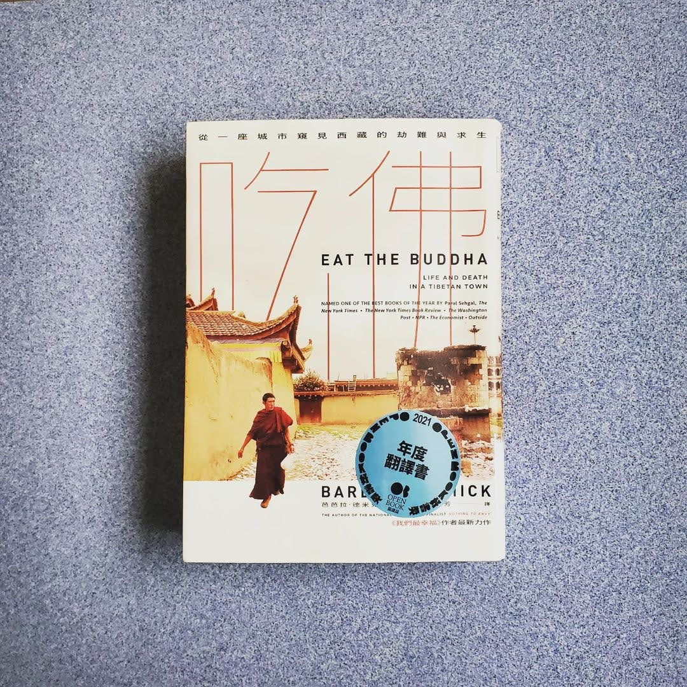

+++
title = "閱樂｜吃佛"
description = "作者：Barbara Demick"
draft = false

[taxonomies]
tags = ["報導文學"]

[extra]
feature_image = "eatthebuddha.webp"
feature = true
link = ""
+++

本書為《我們最幸福》作者的新作品，同樣從一座城市作為起點探討西藏的歷史與人民生活。基於一些歷史因素，中國政府只把一半的青藏高原劃為西藏自治區，但其實「多數」藏人是生活在西藏東部的四川、青海、甘肅、雲南等省份的區域，而故事的地點，阿壩 (Ngaba)，就是位於四川省。

西元七世紀，佛教傳入西藏。在皇帝松贊干布的統治下，藏人建立了可與蒙古人、土耳其人、阿拉伯人互相抗衡的帝國，甚至曾經比漢人還強大，曾經在唐朝安祿山之亂時佔領長安。帝國在九世紀中葉崩解，分裂成幾個小侯國。直到 1642 年，在歷代達賴喇嘛的領導及強大蒙古人的支援下，一個中央集權又穩健的西藏才重新建立起來。但統治的西藏面積不到以前帝國的一半。以前西藏土地的東部，大多分成許多小王國與封地，例如阿壩的美顙王國。

1930 年代，毛澤東的紅軍敗逃到青藏高原 (長征)，抵達阿壩時，士兵因為過於飢餓而洗劫當地寺廟，吃下那些由麵粉與酥油做成的小佛像，他們其實是在吃佛。他們知道那樣做罪孽深重，但滿不在乎。藏人對紅軍展開激烈的抵抗，但仍然不敵。自此，西藏的處境漸漸走向下坡......

## 1958-1978
1951 年，中國當局召喚西藏代表團到北京，並以強迫簽署《十七條協議》的形式，逼西藏放棄獨立。一開始溫和治理，承諾不在西藏推行共產主義，但僅限於拉薩政府以前的領土，不包括多數藏人居住的青藏高原東半部。1958 年的西藏東部浩劫，與大躍進大約同時發生。宗教迫害、僧侶遭羞辱、雕像遭擊碎、繪畫遭焚燬。硬闖進你的城鎮、沒收你的財產、囚禁你家的年輕人、射殺那些抵禦者。他們也根本不懂高海拔地區放牧及耕作的知識，結果導致多年的歉收和動物的死亡。這是毛澤東烏托邦野心失控的結果。清朝滅亡後，蒙古在俄羅斯的支持下獲得了獨立，但西藏沒有這種靠山。1947 年英國退出印度，剛獨立的印度也不願與北京對抗，美國當時在韓戰無暇顧及。於是 1959 年初，24 歲的第十四世達賴喇嘛流亡印度。

## 1976-1989 權力真空期
1976 年，毛澤東過世，繼任者開始經濟改革開放，將現代化擺在階級鬥爭之前。藏人開始有一些可支配收入，寺院也逐漸重新開放。1980 年代中期，阿壩看起來像一個急速發展的邊境城市，中國政府試圖以盡可能俗麗的方式來強行推動現代化。蟲草占藏人現金收入的 40%，且收入是直接進入藏人口袋的現金，不像礦業與林業收入是由中國人主導。但經濟提升也吸引了許多漢人，漸漸青藏高原上的漢人數量超越了藏人。然而好景不長，1989 年胡耀邦過世，並爆發六四天安門事件，寬容的時代嘎然而止。同年，班禪喇嘛因心臟病發過世，其轉世爭議也為藏人與共產黨之間的關係增添了敵意。

## 1990-2013
共產黨指示統戰部加強約束西藏的宗教生活，強迫僧侶們接受愛國教育課程、要求僧侶取得登記證 (要簽署效忠政府及譴責達賴喇嘛的誓詞後才能取得)。科技向前發展，歷史卻倒退而行。愈來愈多的軍隊與武警進駐阿壩，人民的行動自由也受到限制。很多藏人其實對政治不感興趣、對流亡政府了解不多，也不見得反中，但他們看到中國人侮辱達賴喇嘛時就怒不可抑。中國的反達賴行動不僅毫無成效，還適得其反，造成痛苦與誤解的惡性循環。2008 年，在北京舉辦奧運的光鮮亮麗之下，許多藏人同時也在此時遭受壓迫，自焚行動也漸漸變多。西藏維權組織的處境很尷尬，他們不能讓大家以為他們鼓勵年輕的藏人自殺，但自焚事件的確讓他們又成為了世界關注的焦點。

## 2014 到現在
第十四世達賴喇嘛的高齡壓力，也漸漸浮現出來，中國政府未來可能會複製班禪喇嘛那套方法，挑選出受政府控制的繼任者。不過許多藏人是真心感激他們在共產黨統治的七十年裡所獲得的經濟成就，他們要的不是民主國家提供的權利，不是選舉，甚至不是言論自由，而是多數中國公民已享有的基本權利：在自己的國家裡自由地旅行，獲得護照，送孩子到國外接受教育，自己出國旅遊，學習母語，展示精神領袖的肖像等等。西藏流亡政府和多次和中國當局談判，但從沒結果。在爭取獨立的奮戰中，大致上只能退讓。他們已經降低了成功的門檻，存活下來是他們當下的目標。雖然你依然可以聽到自由之類的口號，但如今藏人比較常談論的是在中國的內部與外部保護他們的文化、記憶、語言的自由。他們試圖讓一個在歷史上節節敗退的民族，把故事繼續流傳下去。

從高中時期就一直夢想去西藏走走，總覺得它覆有一層神秘的面紗。看完這本書，對於西藏的歷史與現今的困境有了更深的認識。推薦給大家！