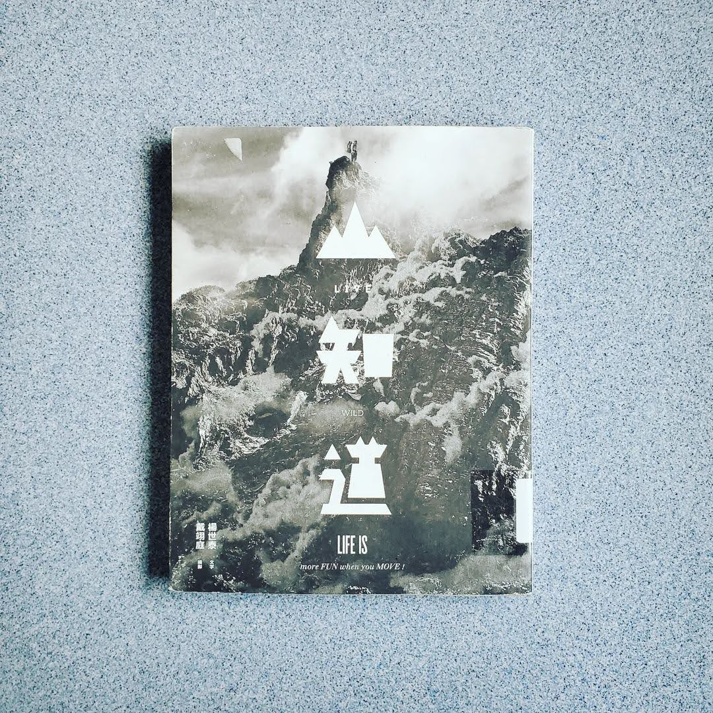

+++
title = "閱樂｜LIVE WILD 山知道"
description = "作者：楊世泰、戴翊庭"
draft = false

[taxonomies]
tags = ["登山"]

[extra]
feature_image = "mountainknows.webp"
feature = true
link = ""
+++

記得幾年前，初次登上小奇萊，身邊只有三個隊友和大自然的聲音，望著對面雲霧繚繞的奇萊連峰，心中滿是說不出的感動，也是這個時候開始愛上爬山的感覺，但是距離上次登上百岳也已是約四年前的事了。最近在台北當替代役期間，假日閒暇無事就會去陽明山、附近郊山走走，也完成了全長 92 公里的台北大縱走，慢慢找回當初登山的感動與快樂。

本書從裝備、觀念、技巧和路線，四個面向分享登山者必知必曉的野外生存 36 計，對於我這種登山新手來說真是本入門的好書。最近在網路上看了許多登山的文章和影片，但閱讀此書後還是有許多收穫，像是我本來很好奇的山上烹飪後的鍋具清理，書中竟然也有著墨。

最近看到台灣登山家詹喬愉登頂尼泊爾的 Amadablum (6812 m)，途中發生一個小插曲：一個摩洛哥隊友似乎不太會看地圖，離開營地後迷路了，卻執著往下走，導致一群雪巴嚮導和登山家花了好幾個小時找人。如今登山運動漸漸盛行，到處都能看見網美在熱門登山路線上打卡。但在登山之前，我們都必須捫心自問，是否做好萬全準備：增強自己體能、準備適當裝備、充實登山知識。

因為登頂不是終點，回家才是。