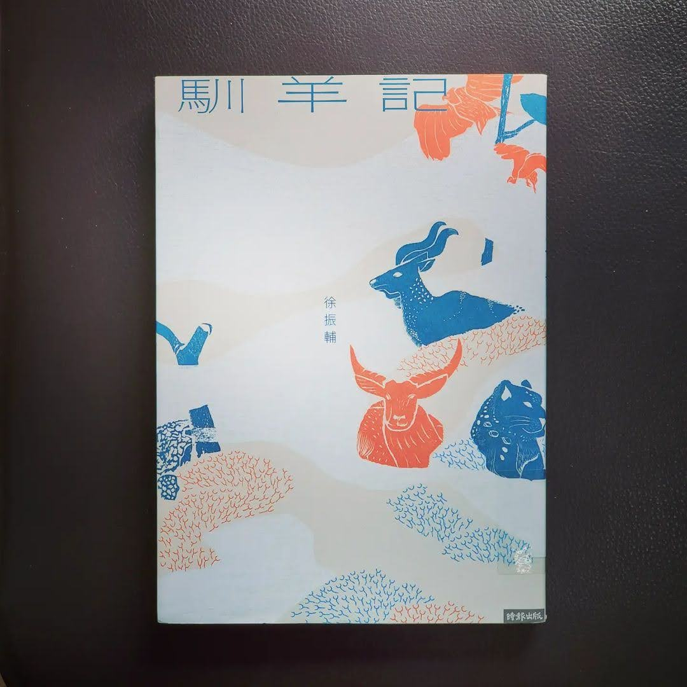

+++
title = "閱樂｜馴羊記"
description = "作者：徐振輔"
draft = false

[taxonomies]
tags = ["文學小說"]

[extra]
feature_image = "xunyangji.jpg"
feature = true
link = ""
+++

一名旅者為了尋找雪豹，再次突破重重阻礙抵達青藏高原，獲准在保育研究站，進行七十二天的雪豹調查工作。回到臺灣，偶然翻開旅行日誌，發現自己的心仍停留在西藏，毅然決定休學，三度重返高原，這次他要追尋的又是什麼？

一九五○年代，宇田川慧海為了理解更精妙的佛法，遠渡印度非法入境西藏，當時藏軍和解放軍正在各地展開游擊戰。他最終落腳拉薩，與記憶日漸模糊但對佛法有精妙見解的桑吉仁波切一起生活。他將所聞見的經歷，寫成《馴羊記》。

徐振輔以兩條不同時空的故事主線，輔以藏戲《文成公主》故事，將西藏七世紀、 二十世紀和當代的重要歷史場景摺疊在一起，讓所有的事件突破時間的限制、羅列眼前，赫然看清一般人認為佛光普照的青藏高原，其實從未平靜。歷經漢代的文化移植，文革席捲，造林停牧，藏人不只命如蜉蝣，原初天性與生活也早已歷劫數次，隨波逐流。

從當代旅者的視角看見藏地的生物萬象，彷如西藏博物誌，岩羊、鼠兔、雪豹、 禿鷲等繫起草原生態的自然平衡，同時也從環境史地理學角度寫羊群流行病現象，拉出礦業汙染、草原鼠災、農牧衝突等環境議題，反映西藏正面臨的情感認同與經濟發展衝突。

整部小說語境優美，哲思與隱喻精妙，融合生態、地理、戲劇、建築、遊記等多種元素，將西藏的人文風景、牧民文化、藏人天性描摹得細緻入微，除了展現出作者深厚學養與田調豐富經驗，更處處可見對土地與人文的深情關照。在悼亡的哀惋中，《馴羊記》讓人們看見歷史如何在這片憂傷的高原上重複搬演，以及人民所面對的困境。

---
不久前剛看完吃佛，對於西藏的過去和現在有了比較多的認識，也因此在看這本書的時候，常常有與所知相印證的感受，蠻不錯的：）