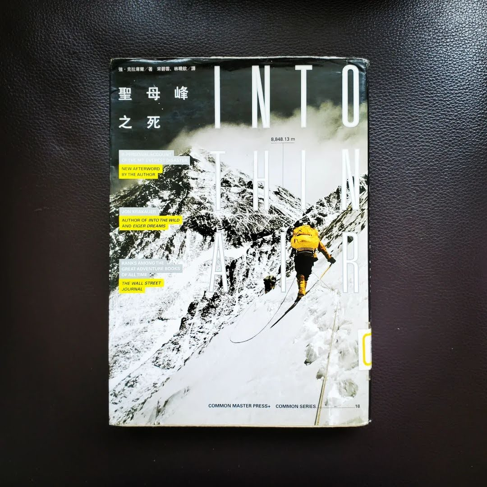

+++
title = "閱樂｜聖母峰之死 Into Thin Air"
description = "作者：Jon Krakauer"
draft = false

[taxonomies]
tags = ["登山", "報導文學"]

[extra]
feature_image = "intothinair.webp"
feature = true
link = ""
+++

「聖母峰的斜坡上不乏夢想家，很多登山者的資歷條件跟我一樣薄弱。但這或許沒什麼好驚訝的，聖母峰對狂人、追求名聲的人、無可救藥的浪漫派及現實感不堅定的人而言，向來有如磁鐵。」

作者於 1996 年受雜誌之邀前往聖母峰，針對登山商業化作專題報導，卻在五月十日下山途中經歷一場暴風雪，共造成十二人喪生，包括幾位頂尖嚮導，是當時聖母峰規模最大的一次山難。作者鉅細靡遺地紀錄事件的經過，回溯整場山難的細節，像是商業隊隊員能力不足、遠征隊之間溝通不良、沒遵守撤退時間等等，過程中一連串失誤的層層累積造成無法挽回的後果。台灣沒有超過四千公尺的高山，更不用說感受八千公尺以上接近平流層的死亡地帶了。在那種低氧環境中可能產生的神智不清和判斷力降低，任誰都有可能倒下，就連首位無氧攀登聖母峰的傳奇登山家 Reinhold Messner 都曾經在山頂前喪失神智。攀登這種等級的高山，可以說是種極限運動了，除了做好自身準備之外，很大一部分也要看老天爺的心情，在山的面前，我們真的要永遠保持謙卑。當然除了悲傷的故事，書中也能看見那些奮不顧身的夢想家，以及無數慷慨助人、自我犧牲的英雄身影，這也是登山的魅力之一吧。

有意思的是，當時攀登聖母峰還有一組台灣遠征隊，由登山攝影家高銘和領隊。書中描述台灣隊的部分大多是負面的語句，像是全隊能力不足、隊長聽到隊友死亡仍繼續往上攀登、不遵守約定好的攻頂時間等。經歷同一場風暴、且幾乎瀕臨死亡的高銘和，在回國後也寫了一本書《九死一生》，從台灣隊的角度看待此次山難，有機會可以再來看看。

看這本書的時候，台灣登山家[呂忠翰 (阿果)](https://www.instagram.com/gonext14peakschallenge/)也在 5/5 登上世界第三高峰干城章嘉 (8586m)，並在數天後回到加德滿都時發文拍片報平安，提到他在最後的一道緩坡二十米的雪原身體斷片，睡在路邊然後什麼都不記得，影片中也可以明顯看到他的幾支手指凍傷黑掉......期待之後能聽到他的故事分享