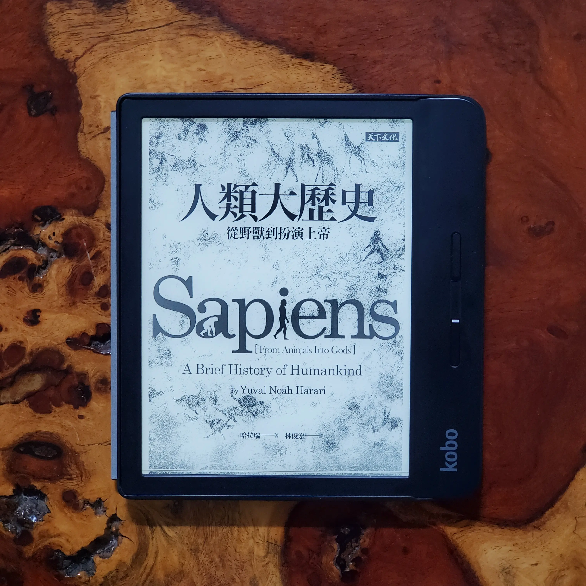

+++
title = "閱樂｜人類大歷史"
description = "作者：Yuval Noah Harari"
draft = false

[taxonomies]
tags = ["歷史"]

[extra]
feature_image = "humanhistory.jpg"
feature = true
link = ""
+++

這本書看了兩個月...慚愧...不過真的很精彩，用少於五百頁的篇幅就概括了數萬年的人類歷史。從七萬年前的認知革命，到農業革命、科學革命，最後討論了人類的未來，雖然每個階段在課本上都有學過，卻鮮少像這本書一樣從當時人們的生活和思想出發，從各種層面分析人類歷史，讓人在閱讀期間常常有「原來是這樣子啊」的感慨。

本書的內容太豐富了，就舉幾個印象特別深刻的紀錄一下：

## 認知革命
1. 七萬年前，智人的認知能力有了革命性的發展，使其他人類物種滅絕 (如尼安德塔人)、越過海洋到達澳洲、出現宗教、藝術和商業。這可能是因為某些偶然的基因突變，改變了智人的大腦內部的連結方式，讓他們以前所未有的方式來思考、用完全新式的語言來溝通，用有限的聲音組合成無限多的句子。
2. 所謂前所未有的思考方式，最重要的就屬「集體想像」。智人開始可以討論虛構的事物，甚至集體想像 (例如神、國家、企業、人權)，讓上千上萬的人們能夠彼此合作，也繞過了基因演化，採用文化演化的快速道路。
3. 現代已開發國家，每週平均工時 40-45 小時，但如果是遠古的狩獵採集者，就算住在最貧瘠的地區，平均每週也只需要工作 35-45 小時。他們大概只需要每三天打獵一次，每天採集三到六小時。一般時期，這樣就足以養活整個部落了。這樣的採集經濟，能讓大多數人過著比農業社會或工業社會更有趣的生活。當時的人們比後來農業社會的人們健康，因為他們不依賴單一種類的食物。這就是最初的富裕社會。

## 農業革命
1. 原本以為農業革命是人類的大躍進，但事實上是植物馴化了智人。普遍來說，農民的工作要比採集者更辛苦，而且到頭來的飲食還要更不均衡。它的確增加了智人的人口數量，但也降低了我們的生活水準，農業革命就是一場騙局。
2. 物種演化上的成功，並不代表個體的幸福。牛和雞比起長頸鹿和狼，數量上多出很多，但在人類的飼養下，未必過得很幸福。
3. 狩獵採集者之所以不管未來，是因為他們就是現採現吃，不管是要保存食物、或是累積財物，當時都不是容易的事。但這也讓他們省下了許多不必要的憂慮。然而在農業革命後，「未來」的重要性來到史上新高。隨著時間過去，人們擁有的東西愈來愈多，不易搬運，也把他們的綁得死死的。
4. 人總是藉口文化來禁止不自然的事。但從生物學的角度來看，這世界根本沒有什麼是不自然的。只要有可能發生的事，就是自然。真正完全不自然的事，是指違背了自然律，但這種事情根本就不會存在，所以也沒有禁止的必要。舉例來說，沒有任何一種文化會禁止男性行光合作用、禁止女性跑的比光速快。

## 人類的融合與統一
1. 分久必合是趨勢，幾乎所有人類都接受同一套地緣政治體系、使用同樣的經濟制度、採用一樣的法律制度，也接受同樣的科學體系，即使屬於不同政體，但仍是一種統一。
2. 三種全球秩序：貨幣、帝國、宗教。
3. 縱觀歷史，一神教就像是萬花筒，例如基督教信奉一神教的上帝，相信二元論宗教的魔鬼，又像多神教徒一樣禮敬眾多聖人，還相信泛靈信仰的鬼魂。像這樣同時擁有不同甚至矛盾的思想，而又結合各種不同來源的儀式和做法，宗教學上有一個特別的名稱：綜攝 (syncretism)。很有可能，綜攝才是全球最大的單一宗教。
4. 佛陀的教誨一言以蔽之：痛苦來自於欲望；要從痛苦中解脫，就要放下欲望；而要放下欲望，就必須訓練心智，體驗事物的本質。（苦由欲起）
5. 自由主義、共產主義、資本主義、民族主義和納粹主義，這些意識形態也是種宗教。宗教是一種人類的規範和價值觀的系統，並且是以相信某種超人類秩序為基礎。

## 科學革命與工業革命
1. 科學研究一定得和某些意識形態聯手，才有蓬勃發展的可能。意識形態能夠讓研究所耗的成本合理化，代價就是意識形態能夠影響科學的進程表，並且決定如何使用研究成果。其中有兩股力量特別值得關注：帝國主義和資本主義。
2. 開始有了貸款。信用貸款資助新發現；新發現帶來殖民地；殖民地帶來利潤；利潤建立起信任；帝國主義和資本主義相輔相成。
3. 有一些宗教 (如基督教和納粹)，曾殺害了數百萬人，原因出於仇恨。然而資本主義也殺害了數百萬人，原因則是出於冷漠和貪婪。同理，大西洋奴隸貿易並非出於對非洲人的仇恨，而現代畜牧業也不是出於對動物的仇恨，這兩者背後共同的推手，還是冷漠。
4. 書中描述荷蘭是如何藉由資本主義從西班牙獨立，甚至成為當時全世界最強的國家。其中大家在國中一定學過的荷蘭東印度公司在當時扮演很重要的角色，主導荷蘭的發展，甚至佔領和統治印尼長達兩百年。
5. 每隔幾十年，我們就能找到新的能源來源，所以人類能運用的能源總量是不斷增加的。這世界缺的不是能源，而是「能夠駕馭並轉換成符合我們所需」的知識。
6. 工業革命最重要的一點，在於它就是第二次農業革命，將人力從農業中釋放出來，使人類能夠從事更多促進科技進步和創意的活動。
7. 如今我們在物質上、壽命上等很多地方的確是有史以來最好的時刻，但我們快樂嗎？